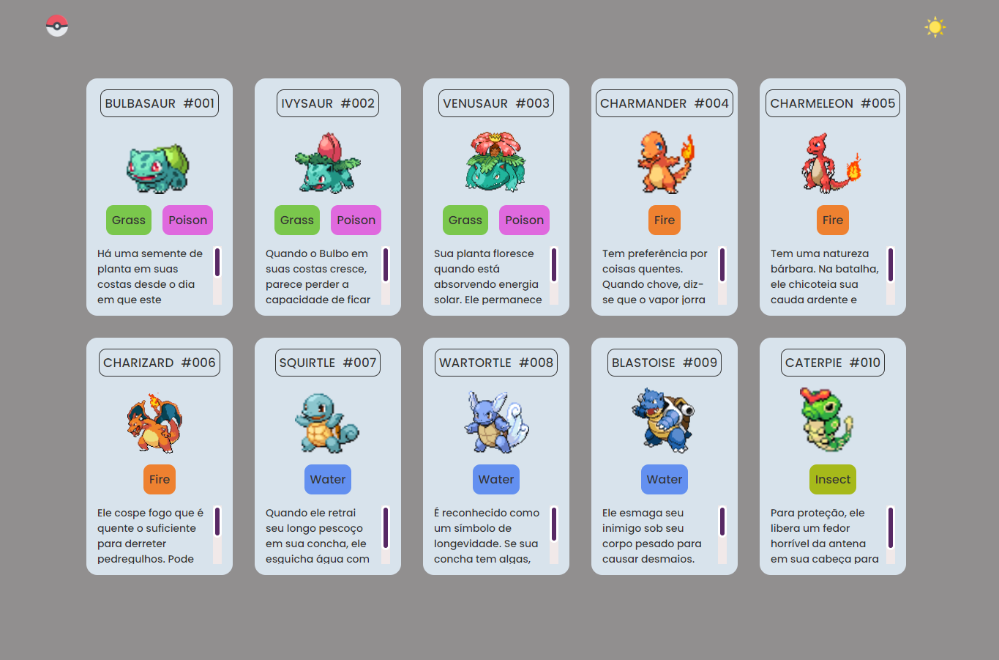
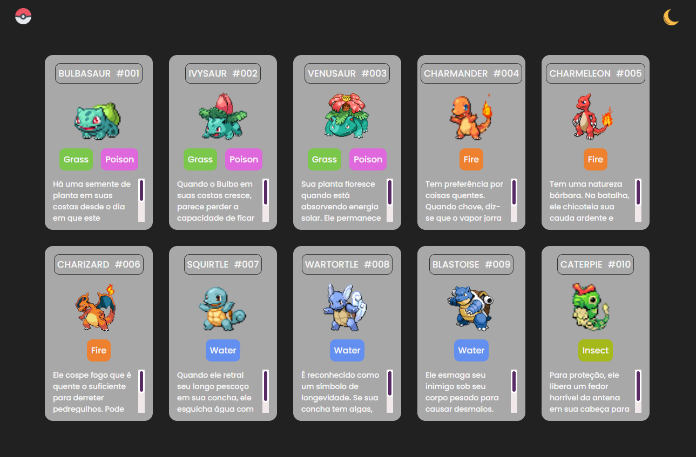
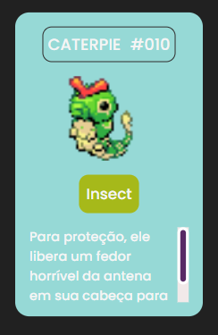

# Projeto PokéList


O projeto Pokélist consiste em uma lista de cards com a imagem e informações de cada pokémom.

## Índice

- <a href='#Funcionalidades'> Funcionalidades do Projeto</a>
- <a href='#Layout'> Layout</a>
- <a href='#Demonstracao'> Demosntração</a>
- <a href='#Rodar'> Como Rodar Este Projeto</a>
- <a href='#Tecnologias'> Tecnologias Utilizadas</a>
- <a href='#Pessoas'> Pessoas Autoras</a>
- <a href='#Passos'> Próximos Passos</a>

## 📱Funcionalidades do Projeto

- [x] Efeito de seleção ao passar o cursor pelo card
- [x] Transição de temas "claro" e "escuro" ao clicar no botão da "lua" e/ou "sol"

## 📐 Layout 








## 🎥Demonstração

[Link Demonstração](https://ffernanda85.github.io/projeto-listagem-pokemons/)


## 🔧Como Rodar Este Projetos

```bash
# Clone este repositório
$ git clone linkrepositorio

# Acesse a pasta do projeto no seu terminal
$ cd projeto-listagem-pokemons

# Execute o projeto através do arquivo index.html. Clique com  o botão direito no index.html e selecione a opção Open with live server

# O projeto será iniciado automaticamente, no seu navegador pelo endereço: http://127.0.0.1:5500/index.html
```

## 🛠Tecnologias Utilizadas

<a href='https://developer.mozilla.org/pt-BR/docs/Web/HTML'> </a>  <a href='https://developer.mozilla.org/pt-BR/docs/Web/CSS'> </a>
<a href='https://developer.mozilla.org/pt-BR/docs/Web/JavaScript'> </a>

## 👩🏾‍💻Pessoas Autoras


[Linkedin Flávia Santos](https://www.linkedin.com/in/flavia-santos-dev/)


## 💡Próximos Passos

- [ ] Adicionar mais pokémons
- [ ] Inserir Páginação
